# 🚴‍♂️ Industrial Bike Demand Predictor: MLOps & DevSecOps Architecture

[](https://mlflow.org/)
[](https://www.jenkins.io/)
[](https://www.sonarqube.org/)
[](https://www.docker.com/)

> A full-scale, production-ready MLOps pipeline for predicting bike-shring demand using **Random Forest**, featuring automated data versioning, security scanning, and model governance.

---

## 🌟 Overview

This project implements a state-of-the-art **End-to-End MLOps Pipeline**. It bridges the gap between data science experimentation and secure production deployment by integrating **Experiment Tracking**, **Data Versioning**, **Security Left-Shift**, and **Automated Governance**.

### 🛠 Tech Stack
*   **ML Core:** Scikit-learn, Pandas, NumPy, Evidently AI (Drift Monitoring)
*   **Versioning:** Git (Code) & DVC (Data)
*   **Tracking:** MLflow (Experiments, UI, Registry)
*   **CI/CD:** Jenkins (Pipeline-as-Code)
*   **Quality:** SonarQube
*   **Security:** Gitleaks, Semgrep, Trivy, OWASP ZAP, OWASP Dependency Check
*   **Artifacts:** Sonatype Nexus (Private Docker Registry)

---

## 🏗 Pipeline Architecture

The Jenkins pipeline orchestrates **11 rigorous stages** to ensure that only the highest quality, most secure models reach production.

```mermaid
graph TD
    A[Git Push] --> B(1. Pre-Flight)
    B --> C(2. Security Scanning SAST)
    C --> D(3. SCA Dependency Check)
    D --> E(4. Data Validation)
    E --> F(5. Smart Training & Drift Analysis)
    F --> G(6. SonarQube Quality Gate)
    G --> H(7. Governance & Promotion)
    H --> I(8. Container Build & Audit)
    I --> J(9. Image Security Scan)
    J --> K(10. Release to Nexus)
    K --> L(11. DAST Security Test)
    L --> M[🚀 Ready for Production]
```



---

## 📋 Comprehensive Stage Breakdown

### 🛡️ Part 1: Security Left-Shift & Data Check
1.  **Pre-Flight & Workspace:** Environment cleanup and workspace initialization.
2.  **Security Scanning (SAST):**
    *   **Gitleaks:** Detects secrets/passwords in the codebase.
    *   **Semgrep:** Static analysis for security-critical Python patterns.
3.  **SCA (Software Composition Analysis):** Scans `requirements.txt` for known vulnerabilities using **OWASP Dependency-Check**.
4.  **Data Validation:** Automatically fetches the **UCI Bike Sharing Dataset** and verifies integrity using **DVC hashing**.

### 🧠 Part 2: MLOps Smart Training
5.  **Smart Training (MLflow):**
    *   Trains a **Random Forest Classifier** to predict high-demand windows.
    *   **Reproducibility:** Automatically tags the run with the **Git Commit Hash** and **Data Hash**.
    *   **Drift Detection:** Runs **Evidently AI** to compare training vs. live distribution, generating an interactive HTML report.

### 💎 Part 3: Quality & Governance
6.  **Static Analysis (SonarQube):** Deep code analysis for bugs, code smells, and vulnerabilities. Enforces a **Quality Gate**.
7.  **Governance & Promotion:** Automatically promotes the best-performing model to **"Staging"** in the **MLflow Model Registry**.

### 📦 Part 4: Productionization
8.  **Build & Compliance Audit:**
    *   Packages the code, model, and metadata into a **Docker Image**.
    *   Runs a live "Audit Container" to verify the inference API answers correctly before release.
9.  **Image Security (Trivy):** Scans the built container for OS-level vulnerabilities and unsafe Python libraries.
10. **Release & Production:** Pushes the finalized image to the **Nexus Repository Manager** (Private Registry).
11. **DAST (OWASP ZAP):** Performs active dynamic security testing against the running services.

---

## 📊 Dashboard Visuals

### 🟢 Jenkins Pipeline Stage View
*A successful execution showing the full breadth of the DevSecOps workflow.*


### 🔵 SonarQube Code Quality
*Total visibility into code health, security hotspots, and reliability.*


---

## 🔗 The Three Pillars of Reproducibility

| Pillar | Implementation | Purpose |
| :--- | :--- | :--- |
| **Code** | **Git** | Tracks exact transformation logic and feature engineering. |
| **Data** | **DVC** | Tracks the specific dataset version used for training. |
| **Experiment** | **MLflow** | Links Code + Data + Metrics + Artifacts into a single searchable Run. |

---

## 🚀 Getting Started

1.  **Start Services:**
    ```bash
    docker-compose up -d
    ```
2.  **Access MLflow:** `http://localhost:5000`
3.  **Access Jenkins:** `http://localhost:8080`
4.  **Access SonarQube:** `http://localhost:9000`
5.  **Access Nexus:** `http://localhost:8081`

---
*Developed with ❤️ for the Industrial MLOps Community.*
